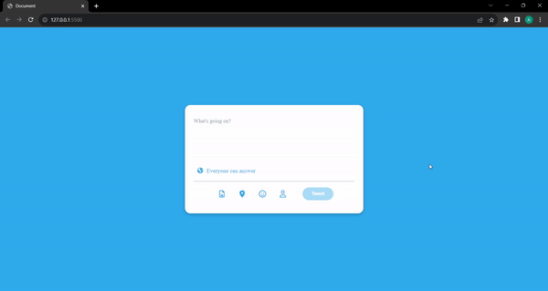

<h1>Twitter Card Project</h1>

This project is an area for sending messages via social media platform. Users can write messages with a limit of 10 characters. If the limit is exceeded, the typed text is highlighted with a red background.

<h2>Content</h2>

<ul>

<li>Home Page</li>

</ul>

<h2>Used Technologies</h2>

<ul>

<li>HTML</li>

<li>CSS</li>

<li>Javascript</li>

</ul>

<h1>Screen Gif</h1>

